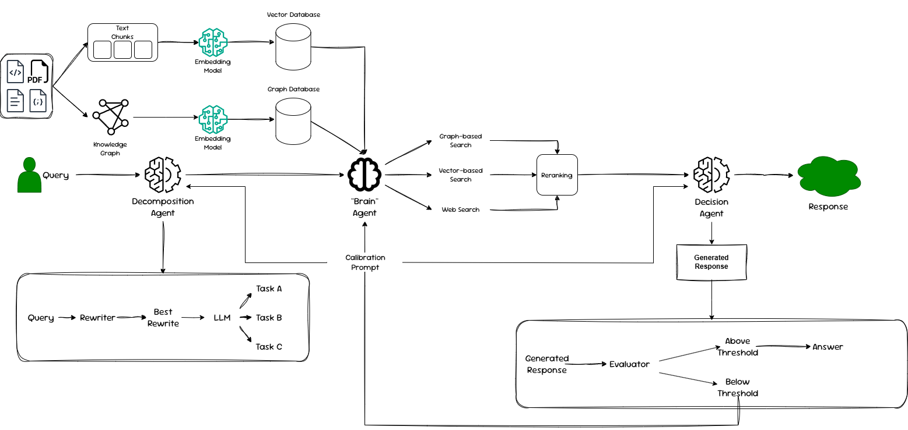

# IRAG-AF: Improving Multi-Agent RAG System for Domain-specific Tasks via Agent-wise Feedback

[Project is still under development]

This project aims to improve the performance of multi-agent RAG via a selective and agent-wise feedback loop, namely the calibration prompt.

This prompt gives feedback to each individual parts of the framework with personalised calibration idea. This calibration idea stems from the evaluator lied inside the decision agent.

Architecture of the project.

## Get started:
1. Pull the repeository
2. Build the environment using uv
3. Create a file named ".env", name a few variables: OPENAI_API_KEY=xxx, TAVILY_API_KEY=xxx, HF_TOKEN=xxx, NEO4J_PASSWORD=xxx, OPENWEBUI_API_KEY=xxx
4. Run the test file, either Ragas.py or Ragas_agent_wise_feedback.py
5. Alternatively, use the pipeline function directly from orchestrator.py or orcehstrator_agent_wise_feedback.py
